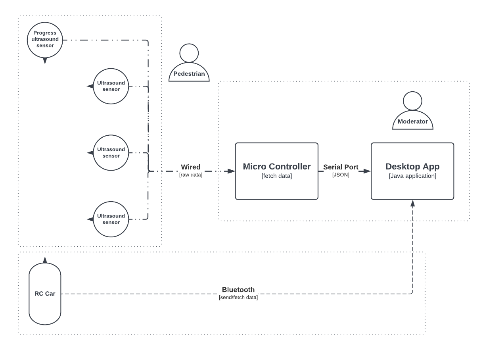
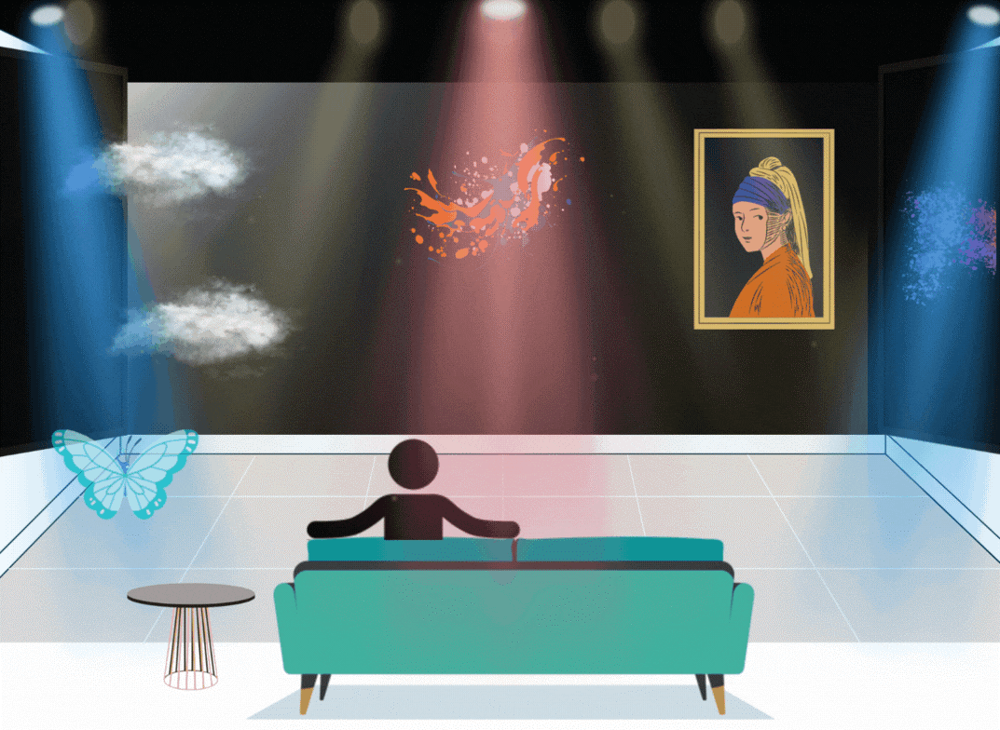
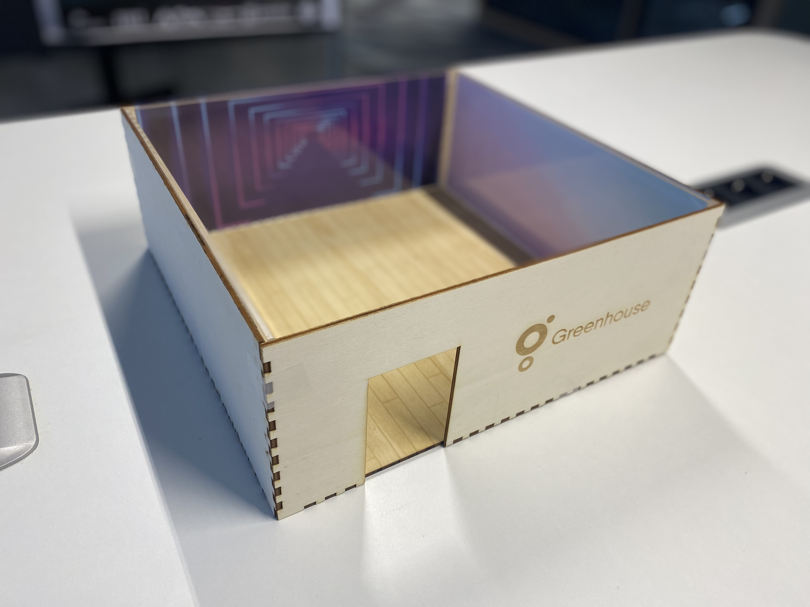
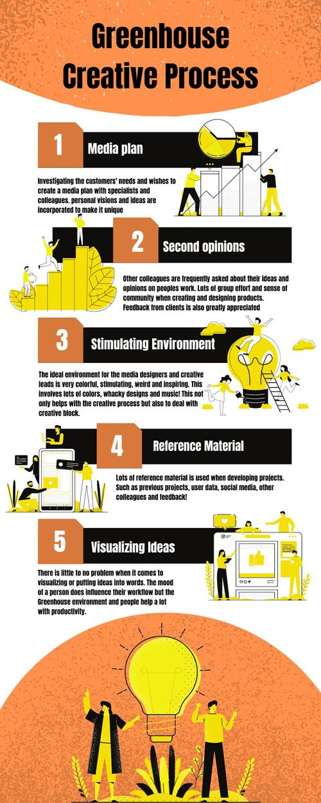
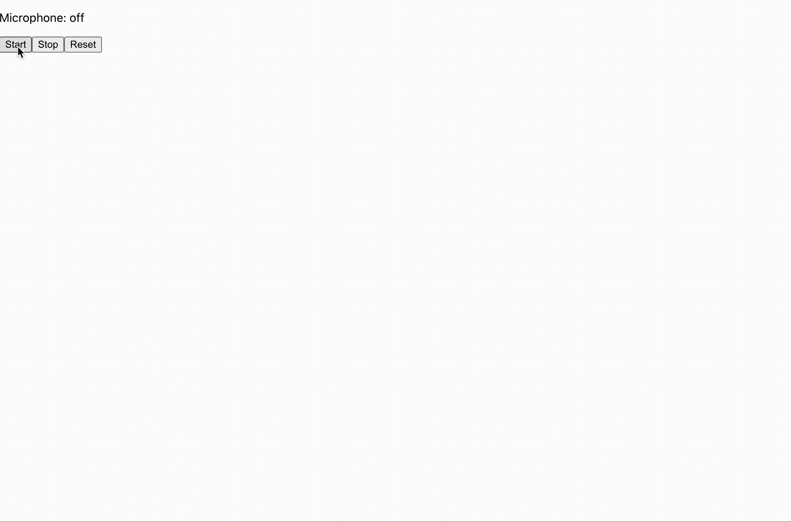
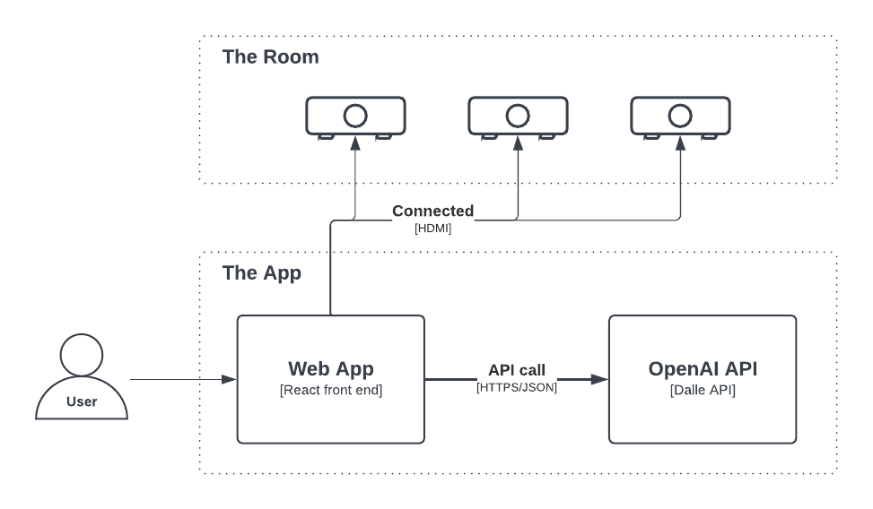
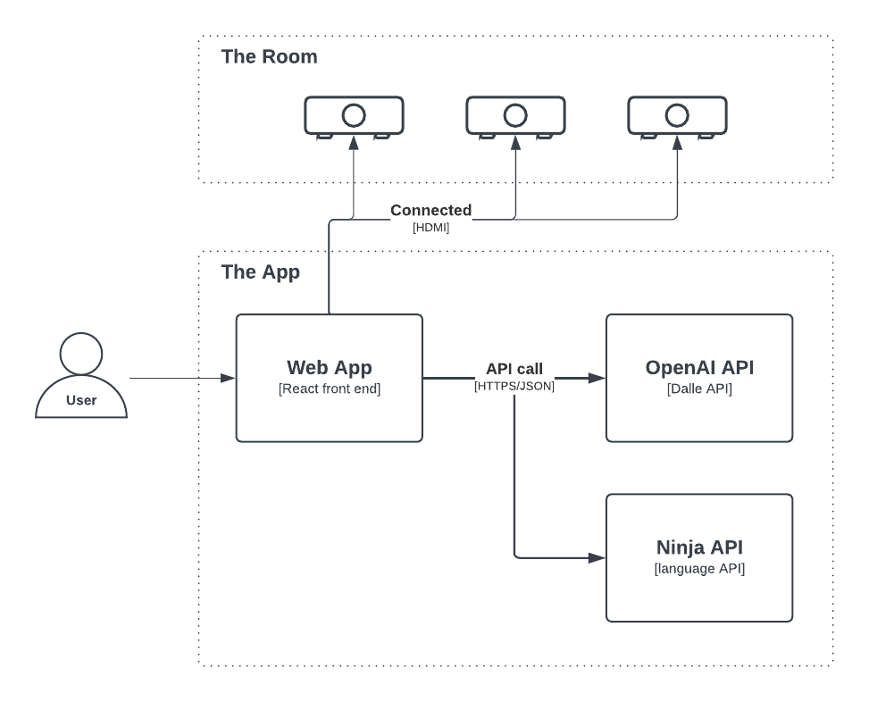
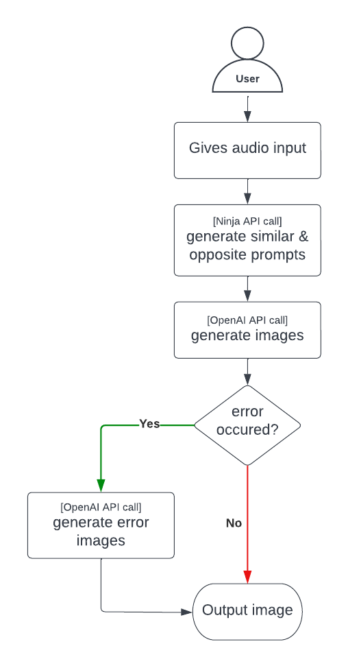
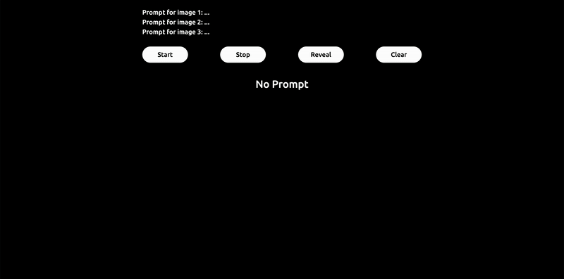

 

 
  <a href="https://rently-io.herokuapp.com/">
    
  <a/>

<h4 align="center">Noah Greff - 433819</h4>

This organisation serves as my portfolio for my 4th semester at Fontys University of Applied Sciences in Creative Technology.

This document will evolve overtime.

 

<b>NOTE - images and gif may take time to load.</b>

 

  
Table of content

<h3>About Me</h3>
  <ul><li><a href="#day-7679_">Day #7679_</a></li></ul>

<h3>Projects</h3>
  <ul><li><a href="#individual-project">Individual Project</a></li></ul>
  <ul><li><a href="#duo-project">Duo Project</a></li></ul>
  <ul><li><a href="#client-project">Client Project</a></li></ul>

<h3>Learning Outcomes</h3>
  <ul><li><a href="#vision">Vision</a></li></ul>
  <ul><li><a href="#innovative-concept">Innovative concept</a></li></ul>
  <ul><li><a href="#interactive-user-experience">Interactive user experience</a></li></ul>
  <ul><li><a href="#prototypes">Prototypes</a></li></ul>
  <ul><li><a href="#present">Present</a></li></ul>
  <ul><li><a href="#personal-growth">Personal growth</a></li></ul>

# About Me

 

> ### Day #7679_

_I go by the "Noah" here. It's been just over 21 years that I have spawned into this world._

_I have been able to travel their world. I have lived in places they name "USA", "France" and "China", the latter of which I have spent over half of my time. Does that make me "chinese"?_

_I have become accustomed to their ways of thinking and doing things. In particular, their ways of working with technology._

_I am pursuing some academic studies in the field of software engineering; currently in my 4th semester. For this semester, they seem to put emphasis on the creativity aspect of using technology to achieve something._

_For the remainder of my time in this world, I truly hope to have some lasting, positive impact no matter how small._

 

# Projects

## Individual Project

> Name:     **Intuitive Computer Interaction**

> Duration: **2 Weeks**

This project, although relatively small, was our first project. It acted as an introductory project where we had complete freedom to choose whatever we want to work on, so long as it was creative technology-related.

# 

The source code of my project can be found here:

#

### Ideation

When I was first introduced to what it means to be a creative technologist, one thing struck me in particular: user interactivity. Essentially, how will viewers/users interact with your work. With this in mind, I started brainstorming some ideas of what I could potentially do for my project.

As a software student, my area of expertise in technology is definitively software. However, when I think about user interactivity, there is always some hardware element that is used to control something virtually. Luckily, we were given various arduino components to play around with. I had all the ingredients I needed to make something interactive.

There is a lot of different places I could combine software and hardware to make something interact. To me, the domain that makes the most sense for such an idea is a video game. Due to the time constraints, I did not want to make build a game from scratch as that was not the main focus of my project, so I settled on using a game that already existed and choose the game _Minecraft_.

3D video games typically use some peripherals that allows the player to control a character. Specifically, the mouse is used to control the direction of the character's viewport (camera) and the keyboard trigger motion and I thought why not replace one of the peripherals with one of the components given. For my idea, I decided to use the gyroscope to control the camera. Why not map the gyroscope's orientation vector to the directional vector of the camera?

### Prototyping

To make my idea come to light, I had to break down my project into smaller steps since I have never worked on such an idea before. Throughout this project, I came up with 3 different prototype where, to my surprise, we can clearly depict an evolution.

#### First Attempt

My first attempt was very much an experimental phase where I was familiarizing myself with programming for arduino's.

Beyond that, this first attempt was all about trying establishing a communication line between the arduino and the game. I initially wanted to achieve this wirelessly but the complexity of such a thing would be time-consuming and that was beyond the scope of what my project so ended using the arduino's serial port to send data.

As a proof of concept, I decided to use a potentiometer to simply change the time of day in the game's world as shown in the first image below (left).

This initial prototype, albeit very basic, took me the longest to achieve as it was all about being able to send data from an analog input into the game. The second image (right) shows the first result of my work. As can be seen, the delay between the input and the ingame time being updated is _very_ large. There is Approximately 9 seconds between an input and an update which is nowhere near as fast as it needs to be for a good user interaction. So I set out to make my second prototype.

  
  

#### Second Attempt

My second prototype was all about increasing the response time between an input and an update. Although the hardware setup remained identical, most of the changes were software-related. I figured if the arduino by itself is capable printing its value extremely fast on the serial monitor on my computer than the delay is most likely software-related.

After some _long_ nights (which eventually turned into short mornings) I have completely changed the way data is received by the game and was ultimately able to achieve a response time that had no noticeable delays. In addition, now instead of sending primitive types as strings, I can send data in JSON format (with [this class](https://github.com/Creative-Technology-S4/Individual-Project/blob/master/src/main/java/me/noahgreff/s4ct/SerialPortJsonReader.java) in a [neat way](https://github.com/Creative-Technology-S4/Individual-Project/blob/master/src/main/java/me/noahgreff/s4ct/Main.java#L30)) which greatly increases the flexibility I have for adding more components in the future (such as the gyroscope).

Ultimately, the only delay was that of the game's update frequency which is 20hz. For user interactivity, this was fine. The results are shown below.

  

#### Final Attempt

For my third and final attempt, I set out to actually implement the gyroscope to control the character's camera. This final prototype was relatively quick to implement as most the useful and time-consuming work has been done by the prior prototypes. It was just a matter of listening for the right data and updating the camera's angle on every tick (20 times per second).

This resulted in the demo below.

  

### Reflection

This project has been really fun to work on. Unlike most project I worked on in the past, the short time given has given me a new way of working in the sense that I had to focus on the stuff that mattered most. This project felt like it was more of a hackathon to quickly get ideas into form. I wished I was given more time to work on this as I think I would have been able to polish my example way more and perhaps even integrate a component to also trigger movement.

I am happy with the outcome of the project. I can now interact with the game using a gyroscope and I think it is really cool.

 

## Duo Project

> Name:     **Suicide Prevention on rail tracks in the NL**

> Duration: **6 Weeks**

> Members:  **Andrija, [Giovanna](https://i464249.hera.fhict.nl), Noah (myself)**

This is our second project which lasted three times longer than the previous project and consequently was three times the fun. One of the major difference compared to the last project is that this is a group project and therefore requires a different way of working.

Although called the Duo Project, our group was composed of three members due to our semester group size being odd in numbers.

In this section, I initially talk about the work done as a group and later talk about my contribution exclusively.

#

The source code of my part of the project can be found here:

#

### Trigger

Every day, thousands of people in the Netherlands use public transport as means of going to and from places. One of those means of transportation, railway, plays a particularly crucial role in that it can transport people (and cargo) across the country in a very fast and (usually) reliable way. Its speed is its strength, although sometimes, poor souls see it as an effective way to quickly end their lives.

After doing extensive [research](docs/duo-project/research_doc.pdf) (compiled into a doc by [Giovanna](https://i464249.hera.fhict.nl)), numbers indicate that over the last decade, the number of people committing suicide by trains steadily increased despite NS and ProRail efforts. Hundreds of people lose their lives across the country that way which, apart from the tremendous cost on every incident on handling the situation, it can have devastating and lasting effects on people involved.

For this project, as a team, we decided to focus our attention towards making an impact. Specifically, exploring the ways in which NS and ProRails can utilise technology to further reduce the amount of suicides on rail tracks. From that, our main research question was:

**How can technology be used to prevent suicides on rails in the Netherlands?**

We have explored different ideas that could help us towards achieving our goal; both using software and hardware. (Moreover in the next section)

### Ideation

#### Idea N.1
As a group, we have experimented with different ideas to tackle our research question. Since our domain revolved around technology and software, we were thinking whether an app could help reduce the amount of yearly suicides on tracks. we came up with the aptly named mobile app, *HelpMate*, thinking that the ultimate reason why *people* commit suicide is because of *people* and that with technology, we can connect people in need with people who are able to help.

  

#### Idea N.2

Our second idea revolved more around hardware and working towards a product solution that NS and ProRail could theoretically fund to reduce incidents. After an interview (available in the [research doc](docs/duo-project/research_doc.pdf)), we discovered that incidents tend to happen in more secluded locations; where people are scarce and where cameras are ineffective.

We concluded that added sensors into the equation could be an effective way to be able to also detect people in bushes and such.

The basic idea is to make the train stop when a sensor ahead of the train is triggered. (Moreover in the next section)

### Prototyping

#### Prototype 1
To have a better understanding of how and what we were going to work on, we made a very lofi-prototype does not include anything technology-related.

During normal circumstances, no sensors triggered, train moves along:

  

During abnormal circumstances, a sensor is triggered, train stops before the sensor:

  

#### Prototype 2

As a second prototype, we have simply translated our paper model into software:

  

#
> **Disclaimer: Beyond this point, I talk mostly about my contribution to the project.**

To actually transform our first prototypes into a working demo, I utilised my software skills to break down our model into different components. This resulted in this final system diagram below:

  

As shown on the diagram, I have concluded that there are three major components to work:

* The sensors
* The RC car (our train)
* The desktop App

These components have been worked on for prototype 3 and 4.

#### Prototype 3

For the next prototype, I worked on two of the three major components. Over a period of two weeks I worked on was the desktop app (a.k.a. Mission Control) and on the sensors.

This app acts the brain of the entire system. This desktop app would typically be used by people overlooking the entire train operation remotely. Essentially the desktop app (mission control) ties everything together by processing sensor data and dictates to the RC car (the train conductor) whether to stop if a sensor is triggered.

To make the app, I made a JAVA application and simply reused and improved the code from my individual project to have serial communication with a microcontroller.

Once that was done, I started work on the sensors that would be placed along the tracks to detect people. For the purposes of this demo, we have settled on using Ultrasound sensors.

For more technical details, I have the code for the app [here](https://github.com/Creative-Technology-S4/Duo-Project/blob/master/src/main/java/us/duoproject/Main.java) and the code for the ultrasound sensors [here](https://github.com/Creative-Technology-S4/Duo-Project/blob/master/ino/beacon/beacon.ino).

When tying those two components together, we get this rough demo that showcases which sensor is triggered where on the screen in real time.

  

#### Prototype 4 (prototype 3 revisited)

For this final prototype, I worked on the final component, the RC car. Specifically, how can I send data to it to make it move and stop on demand. This phase lasted for quite some time because it was quite challenging to troubleshoot the bluetooth module and send data from the desktop app to the RC car.

My first attempt was to simply connect any bluetooth device and be able to send data to make it move/stop.

  

After a lot of time, (I will spare the details), I was able to make the desktop app send data to the RC car via bluetooth and make it move automatically (left). This in combination with the previous work on done with the sensors, I was finally able to control the RC car based on whether a sensor is triggered (right).

  
  

### Expo

When D-day came, we were able to demo our work in details with a fully working prototype. We showcased all our prototypes and made a presentation to talk about the process as well as impact. As soon as the expo started, many people came to see our work and seemed to be intrigued by our setup. People were engaged and could interact with our product in a way that is natural.

  

### Reflection

This project has been really fun to work one. Giovanna was very involved with the project and I believe that we were able to go from a very basic concept to a full-fledged working prototype exactly as described initially. As a software student, I was able to really bring forth my expertise I felt like I played an integral part of the project. Towards the end, I was able to explore some concepts with Andrija too but ultimately settled with our initial ideas.

From the first feedback session I had for my individual project, I was told that I was able to utilise my software abilities to find good solution with technology but that my solution did not revolve as much around making impact as it should. In this project, I believe that I was able to overcome this issue and work more towards thinking about technology as mean to reduce suicide rates on rail tracks.

As a group, we have decided to provide feedback for each other too:

  

 

## Client Project

> Client:   **Greenhouse**

> Duration: **9 Weeks**

> Members:  **[Dion](https://dion-portofolio.webflow.io/), [Giovanna](https://i464249.hera.fhict.nl), [Coen](https://portfoliosemester4.vercel.app/), [Rik](), [Kaloyan](), Noah (myself)**

This project was our final and, arguably, the most important project of the semester. Being an upscale version of the previous project, we were a group of six and focused on exploring how Greenhouse, a digital marketing company in Eindhoven, can use generative AI in their field.

Due to the abstract nature of the project, our approach to tackling how generative AI could bring value to Greenhouse was heavily focused around research. Specifically, the effects of AI generated content on people's creativity and emotions and how we may achieve this.

<!-- In general, I will talk about the work we did as a group and mention explicitly my contributions to the project from time to time. -->

> Note: I have sequenced this section into different sprints which will evolve over time.

#

The source code of my part of the project can be found here:

#

### Sprint 1

#### Research

> ICT Methods: Best good and bad practices, Literature study

Although the scope of our project had few constraints, it was very difficult for us to find something product solution to work on that would satisfy our Greenhouse's needs. This is why we have dedicated a significant portion of this first sprint on doing research.

Each group member had some preconceived perceptions of generative AI but none of us were on the same page. Therefore, each of us made some research on various aspects that revolved around AI generated content to deepen our understanding.

I, for one, tried to answer: *What is generative AI?*

Generative models are used to create images and audio from a set of data. These models can be used for many purposes, such as image generation, speech generation, and text generation. Generators are commonly used in computer vision applications to generate images from data, or for audio generation in the form of speech. They can also be trained to learn the characteristics of the data that they are given.

I think that [Sassbook AI Writer](https://sassbook.com/ai-writer) summarized the results of my research fairly accurately with its answer above.

#### Brainstorming

> ICT Methods: Brainstorm, Usability testing

After we made individual research, we proceeded to brainstorm ideas.

Through many discussion sessions, we all gave our understanding of generative AI. We had gathered many ideas and summarized our findings into a mind-map, as shown below.

  
  

We initially focused our attention towards how we may affect people's emotions through images and audio but over time we shifted towards something that focused more on Greenhouse, specifically their employees and how we may trigger inspiration.

Through these discussions, I have given my take on generative AI and conveyed that AI generated images presented the most potential for influencing people. We had some doubts and decided to take our research further.

#### Testing

> ICT Methods: Usability testing, Wizard of Ozz

After brainstorming, we proceeded by doing some user testing. During this testing phase, we concluded that both images and audio had an effect on people's emotions and creativity but that images had much greater impact.

Moving forward, we focused on image generation and how we may use it to influence Greenhouse employees.

#### Prototyping

> ICT Methods: Concepting, Prototyping

We wanted to work on a solution that primarily focuses on AI generated images to stimulation emotions and creativity.

To encompass both of those elements, we settled on the idea of having a dark room with projectors. User would be able to convey their inputs after being prompted into some app which would be used to generate images with an AI, as shown in the image below.

  

For our client however, we wanted to showcase something more professional and visual, and we decided to model this room into wood using the laser cutter.

This was my first time using the laser cutter. With the help of [Giovanna](https://i464249.hera.fhict.nl), I modeled a scaled down version of our room which we could present alongside with a presentation to our client.

It took us a few attempts to ultimately obtain our first lofi but clean prototype:

  

#### Presentation

This was our first presentation with our client. This presentation was particularly important as this presentation served mostly as means to both showcase our progress and receiving feedback on whether they liked our concept.

Along with a presentation, we showed our prototype and explained how and why we did user testing.

Our physical prototype showcased our ideas to the client effectively, and we were able to get invaluable feedback. The client liked the direction we were going in which gave us the green light to expand on our ideas more.

During this presentation, I had a more passive stance and participated during the questioning phased to clarify some things to our client such as how will users is able to control the images displayed through the projectors.

#### Reflection

This first sprint has proven to be a vastly different experience than the previous projects I worked on. This is primarily due to the nature of the project more than anything. Compared to the previous projects I worked on, I worked far more on research and testing rather than prototyping. After extensive research and testing, we have uncovered the effects of AI generated content on people's emotions and creativity.
This first presentation went well and our client liked our idea. I was excited to move forward in this project.

### Sprint 2

#### Research

> ICT Methods: Available product analysis, Literature study, Requirements prioritization

For this second researching phases, I also took the time to familiarize myself with available APIs or libraries that we could potentially incorporate in to our project.

I kept in mind the following core software requirements:
- the ability to generate images based on some input
- the ability to use speech for input
- the app must be portable
- the development process should be short

During my research, I noticed that there were lots of websites that allow users to input some text to generate images, audio or text, but they were all guarded behind a very restricting paywall. This would have made the development of an application either expensive or difficult and limited however, Greenhouse has given us access to an OpenAI key. So I started making some research with what was available with OpenAI.

Since we definitely wanted to add an image generator, I dug around and discovered that Dall-e 2 was available on [OpenAI](https://openai.com/dall-e-2/) and settled on using that.

An important requirement for the application we wanted to build was to be able to run it on any device because we were not entirely sure on what device the application was going to be running on ultimately. In my opinion, the simplest solution was make a web application because it is relatively easy to run on both smartphones and laptops.

I have settled on using [React](https://reactjs.org/) as a framework to develop the application for a few reasons. Firstly, because there is a very large community to continuously work on very useful libraries. Secondly, because all the group members that were doing software had done some work with the framework. Lastly, and arguably the most important reason, because react enabled us to do rapid prototyping which was essential as we did not want to spend too much time working on some feature that the client did not want.

As mentioned, there is a wide range of readily available libraries in the React ecosystem for many uses. For voice input, I discovered [react-speech-recognition](https://www.npmjs.com/package/react-speech-recognition) which was also promoted as being easy to integrate.

#### Interviews

> ICT Methods: Interviews, Observation

After our first visit to Greenhouse, we needed to understand our target audience: Greenhouse employees in their creative department.

To do that, [Dion](https://dion-portofolio.webflow.io/), [Coen](https://portfoliosemester4.vercel.app/) and I decided to visit Greenhouse once more to take the time to interview their employees.

We asked various types of questions which included (but are not limited to):
- What is your primary source of inspiration (audio, visuals, etc)?
- What kind of reference material do you use when working out your ideas?
- When working do you prefer peace and quiet or a lively environment?

The results of our interviews are shown in the infographic below (made by [Dion](https://dion-portofolio.webflow.io/)):

  

By conducting these interviews, we gained valuable insight into their work and their creative process when working on a project.

#### Prototyping

> ICT Methods: Stakeholder analysis, Product review

Last sprint we came you with a prototype for the room. This week we wanted to make a prototype for the app we had envisioned up until this point.

From the research I have made, I was able to quickly make a web app (on the left). I had a meeting with the rest of the group and we discussed possible designs and features we wanted to add. For the second sprint demo, this MVP was more than enough to get some useful feedback.

I wanted to address the design of the application as at the time it was absolutely bare bones. [Dion](https://dion-portofolio.webflow.io/) gave me a design he had in mind and I merged it with some design elements that I worked on along with [Kaloyan](https://dion-portofolio.webflow.io/)'s audio knowledge.

The results I think we adequate for demo purposes (on the right).

  
  

#### Presentation

For this sprint, I was one of the presenters.

During this presentation, we talked about some research and the results interviews of the interviews as well as showcased a sketchup of the room and eventually the app. We asked our client about some possible options they would like to see in our next meeting and received some suggestions to move forward.

Our client was invested in our project and asked various types of questions, ranging from the interviews and research we did to the technologies we use to make the app.

#### Reflection

For this sprint, things were much more hands on. I had the opportunity to meet Greenhouse clients directly. This was invaluable because for this sprint I wanted to start working on the app we envisioned in our first sprint.

As a software student, the design of the applications as not my strong point. Generally however, I genuinely like working on the design and compared to the previous projects, I could incorporate some visual elements which I find very interesting such as the audio input circle.

During the presentation phase, I wanted to get more feedback on the app; specifically what to add next.

Overall, I think this sprint has shifted into a phase that is more focused on applying the research we have done into concrete ideas. With this trend in mind, I believe that next sprint will be much more focused on hardware/software than the previous sprints.

### Sprint 3

#### Discussion

After the end of Sprint 2, our research and prototype has been validated; our client was happy with the direcion we were going with. The next step for us was to discuss how we were going to use the app we made in an actual showroom. 

During that period right before Christmas, I left early and therefore was not able to play an active role in where we were going to setup everything. However, based on the location they have chosen and the feedback, I took the time to modify the app to match our needs. Since the room is going to have three projectors, we talked about displaying three different types of images randomly. One image would be generated directly based on the input, another using synonyms and lastly using antonyms.

#### Addressing New Requirements

To generate the three different images, Coen and I made some research online about APIs or libraries we could use to do this. We ultimately settled on using an external API to fetch the synonyms/antonyms.

The next step was about intergrating that with the current version of the app. To cut the technical details short, we have generate some diagrams on how the app looked like before and after the changes we made.

##### Prior to changes

  

##### After the changes

  

After the changes and some user testing, we noticed that sometimes the Dalle API would return a 400 response conveying that some words used were illegal (ei. cocaine, decapitation, killing). Although those words may not have been inputed by the user directly, sometimes the synonym/antonym API can generate those prompts.

To address this issue, we decided to simply regenerate the errored image into something that displays a stop sign. Here the process of generating images from a single audio input:

  

#### UI Improvements

As part of the skills that I wanted to improve upon, I wanted to modify the user interface to allow the user to have more control over what the app does. Such as adding whether to record the audio or simply clear the app.

In addition, together with [Kaloyan]() we some disscusions going back an forth about how we may integrate the Greenhouse logo as an indicator that the app was recodring the user's audio input. 

Here is a demo of all the previous changes mentioned:

  

#### Presentation

===

#### Reflection

===

 

# Learning Outcomes

### Vision

> You express your own vision on future scenarios through research of the evolution of mankind’s relationship with technology.

#### Week 4 (Individual Project)

When thinking about the relationship between humans and technology, the only practical way someone can interact with a computer is via the typical mouse and keyboard. I was thinking whether this would always be the case. What if we removed the mouse or keyboard? What would be another peripheral that can be used instead, a camera? I wanted to explore this a bit more in my personal project and built an analog controller that (partially) removes the need to use a mouse to play in the game Minecraft.

#### Week 9 (Duo Project)

In the Duo Project, we started by identifying a problem: cases of train-related suicide has not changed over the past decade in the Netherlands. We made some research into finding out what NS and ProRail already had in place to mitigate such incidents and discovered that more could be done to further reduce case counts. With the use of existing technology, I have discussed with my teammates how we could develop an app to use along with some sensors to control the speed of trains.

#### Week 15 (Client Project, Sprint 1 & 2)

It is not very common for me to hold some strong opinions on some piece of technology (apart from NFTs) however, when it comes to AI generated content (ei. images, text, audio, etc) or AI in general, I can see clear trends that is going to propel AI rapidly into our everyday life.

My interest in computers really began when I was in middle school. I started paying more attention to hardware, specifically GPUs (the part of a computer that delivers computing power). Over the years, performance increased steadily however, in the last two years, GPUs have become orders of magnitude better than the previous generation GPUs. I have also noticed that this trend is very similar to the capabilities of AI where, over the last two years, we see a high jump in the capabilities of AI models released.

There is a clear correlation between the release of more powerful GPUs and the release of more capable AIs. This might be obvious, but I find it fascinating that it takes both hardware companies (ei Nvidia) and software companies (ei Google) to truly make technological breakthroughs and not sole companies.

My point is that the more powerful the GPUs, the more capable the AIs. There will inevitably be a point in time when AI will shift from an experimental state to a more defined role in our day-to-day life beyond just tools used for statistics and targeted advertisement.

The client project enables me to explore the current state of those AIs and how they might be used to stimulate emotions and ideas.

#### Week 18 (Client Project, Sprint 3)

During the demo day, I came to the realisation that our project, although technically simple, touched base on something deeper than just using technology to create a product. Our project was about exploring how we can break traditions through inventions; how can we break the way humans create ideas based on existing sources of inspritation using generative AI. The idea that a computer is able to quickly compose an image based some on input and project that to a group of people achieves this. Instead of relying on work online or from other co-workers, AIs can be used to create inspiration for you. This can be esspecially helpful in areas where sources of inspiration are scrace. Generative AI can be used beyond just sources of inspiration as well.

#

### Innovative concept

> You discover and define an innovative concept using creative thinking techniques combined with research of technology, context and human.

#### Week 4 (Individual Project)

For my personal project, I have spent some time investigating possible ways in which someone can interact with computers without a mouse and keyboard. Initially, I wanted to use a camera and detect the direction of the user and map this to the character's camera however, if the user wanted to look up in the game they would have to look up themselves which would make looking on the screen difficult. A better way was to use a gyroscope that could be held and used as a joystick.

#### Week 9 (Duo Project)

In the Duo Project, as a team, we experimented with various ideas on whom we might address problem of suicide on rails. We initially started working on the idea that a mobile app can connect users to people dangerously close to train tracks. After some mockups, we concluded that it might be as effective as a mechanism that slows trains down when triggered by sensors.

This is when we spent our full attention towards what we could do with the technology that we have available. For example, when deciding on what type of sensor to use, we were thinking about heat-sensing devices and other types of sensors but ultimately concluded that, for the purposes of our solution, ultrasound sensors was the ideal choice.

#### Week 15 (Client Project, Sprint 1 & 2)

For the client project, we were not given any specific requirements as to what type of generated content we should focus on. We all had very vague ideas on what to do, but we all did research to consolidate our concept. The research that I have done revolved specifically around the technical aspect. In general, what can we do technically that is achievable within the time frame we have. I made some research into what kind of APIs were available as well as what type of generative AI we can incorporate in our project.

During the many discussion sessions we had over the first sprint, I have communicated my research and given my opinions on what I believed to be feasible as a solution we could deliver to our client in terms of software.

During the second sprint, I have spent some time putting the research I have done into a demo-able prototype. For this app, I have also made some research into the ways the application can handle user inputs and I have concluded that we can use speech recognition to avoid having the users manually enter their inputs.

#### Week 18 (Client Project, Sprint 3)

triggering thoughts by randomizing images

===

#

### Interactive user experience

> You design an experimental interactive user experience that investigates a technology’s potential and its mutual effect on people.

#### Week 4 (Individual Project)

Perhaps the most intriguing work I have done so far almost entirely revolved around user interaction. In my personal project, I have explored ways someone can play a video game through hand motion. I was thinking about what would be the most fun and, more importantly, more intuitive way someone can control a character's camera. Of the components that were given, I saw the gyroscope as having the most potential to emulate natural user interaction.

#### Week 9 (Duo Project)

In my Duo Project, the final prototype had key interactive elements; the ultrasound sensors. The fundamental goal behind our solution was to detect the presence of entities in a particular location an act depending on whether a sensor has been triggered. We have experimented with other sensors but decided to use ultrasound sensors as they have shown to be the least time-consuming component to set up in large quantities, which in turn allowed use to focus our attentions on other part of the project more such as the Desktop App's UI. Through user interactions, people were able to see in real time when a sensor is triggered onscreen.

#### Week 15 (Client Project, Sprint 1 & 2)

From the feedback I have received previously, I was told to improve my creative skills when it comes to working with user interfaces this is definitely a something I would like to address in this project. Luckily for me, we wanted to have an app. This time, I paid particular attention to the appearance of the web application. With the input of [Kaloyan](), I worked on what believe to be a really cool way of visualizing voice inputs because that was a feature that I really wanted to highlight. Later, [Dion](https://dion-portofolio.webflow.io/) had showed me his take on the app's UI and have incorporated some elements which resulted in a very simple but functional demo that was also appealing.

Essentially, the user is able to input some information through speech and the app would handle generating and displaying the image autonomously.

#### Week 18 (Client Project, Sprint 3)

Our project's success is ultimetly measured by the user experience. We used a variety of different pieces of technology to create an interactive room. By incorporating audio input and visual feedback on large screens, our product served as means to promote conversation and brainstorming. Throughout our testing, people were easily able to comment on some pictures like pointing out odd features or unexpected compositions.

#

### Prototypes

> You collaboratively realize and test a series of prototypes and its potential, for both users and stakeholders, in real-world application.

#### Week 4 (Individual Project)

In my personal project, I did a series of prototypes which were incrementally better compared to the previous version. Through prototyping, I was able to break down challenging problems into smaller, more manageable problems. This has ultimately allowed me to quickly add additional functionalities as I had a clearer vision of the final product. Had this project continued, I believe that I would have been able to add more controls rapidly.

#### Week 9 (Duo Project)

The Duo Project was all about figuring things out as a group. I had some ideas on how to tackle our research question and so did the other team members. The key was to combine our thoughts and skills to prototype our ideas. Throughout our project, we have made a series of prototypes; ranging from a paper model to a working system able to stop a moving vehicle to avoid a collision with an object. Each team member focused on their strength in particular which reduced time between prototype iterations.

Our prototypes were dictated based on feedback given. Everytime we showcased our prototype, we received valuable insight from external sources which I believe has had tremendous impact towards our final prototype.

#### Week 15 (Client Project, Sprint 1 & 2)

For the client project, our approach to Greenhouse's challenge was much more conceptual and did not really focus on any specific piece of hardware or software. This was interesting and fun because this enabled me to work on prototypes that did not necessarily revolve around code and programming like the previous projects.

For our first prototype, we wanted to convey that our idea was based around a room with projections of AI generated images. For that, with the help of [Giovanna](https://i464249.hera.fhict.nl), I worked for the first time with the laser cutter. I experimented with different designs on a computer program before printing out a small mockup room. I discovered that the laser cutter was extremely precise. This was good news because I wanted to make the prototype a bit more complex by adding an inner transparent box that would be rigid enough to hold images in place against the walls.

For the second sprint demo, I went back to my comfort zone and develop a small web application that would showcase how through speech, an image could easily and quickly be generated from an API. For this app prototype, it was important for me for this to be quick as the feedback we would receive from the client could drastically change how the app is coded.

Overall, I am quite happy with the prototypes and I think they were able to convey our ideas effectively.

#### Week 18 (Client Project, Sprint 3)

After getting a room for our project, I worked closely with [Coen]() to be able to have the app displayed on three projectors simultaneously. The initial version of the app had some convenient functionalities that were missing such as to clearing the prompts for the next user. The final version of the app was tailored to the showroom's setup and were able to effectively use during the demo day. Overall, I am very pleased with the final version of the app prototype and how it was used.

#

### Present

> You present your research outcomes, prototypes and reflections in relation to your research, concept and vision, to stakeholders, peers and potential future employers.

#### Week 4 (Individual Project)

During the demo day, I prepared a presentation showcasing my idea, process and impact of my product. However, I believed that the result of my project was more than just something to present via a presentation and I prepared the game along with the gyroscope for people to use experience the controls for themselves. This made my demonstration more interactive and engaging to people.

#### Week 9 (Duo Project)

For the duo project, the set-up of our booth played an essential role in conveying our final product as well as the process. As shown in the image in the Duo Project, under Expo, we have displayed our initial prototypes on the left and presented our final prototype in the center. To accompany our prototypes, we made a presentation to talk about how this product connects to the real world, our process and the impact it might have.

When the expo started, we have immediately attracted people's attention. People were involved in experiencing our product. They could interact with the sensors and see for themselves the RC car automatically stop to avoid collision with their hands. They were genuinely intrigued on how everything tied in together.

#### Week 15 (Client Project, Sprint 1 & 2)

The client project revolves a lot around the client's needs. Although we were only given the opportunity to meet twice, we made sure to present as much relevant information as possible in a relatively short amount of time.

My part in this was relatively passive for the first sprint presentation. I did not present, however, I maintained the conversation with the client after the presentation to ensure that the client was satisfied with our approach to how Greenhouse can use generative AI; before the presentation, I feared that the client would rather want us to focus on their clients rather than Greenhouse employees. We got some clarification and concluded that they were on board with our idea.

For the second sprint presentation I was much more active as I was one of the two presenters. I really enjoyed presenting because it enabled me to showcase the work and research we have put so far. I made a demo app to demonstrate more concretely how we envisioned gen. AI to be used by Greenhouse employees. The reception of the presentation was very positive, and I was satisfied with the feedback we got to further improve the app and, in general, our project.

#### Week 18 (Client Project, Sprint 3)

demo day, the room

===

#

### Personal growth

> You articulate your professional ambitions and focus and demonstrate your efforts and growth within the roles you fulfill in your projects.

#### Week 4 (Individual Project)

Being a student from the software branch, my comfort zone is software programming however, I always wanted to use my skills to build something fun and interactive such as controlling a drone with a VR headset but never knew how to link software and hardware together. The personal project has given me the opportunity to focus exactly on that. In the future, I would like to work more on projects like this.

#### Week 9 (Duo Project)

I have put forth my technical skills in the Duo Project to communicate how we might address our problem from both a software and hardware point of view. I believe that, with the input of my teammates, I was able to produce results that pushed our prototypes forward. I was involved in almost all the programming that was done as well as did some pair-programming with Andrija to further explore possibilities.

#### Week 15 (Client Project, Sprint 1 & 2)

For the client project, I worked on a few aspects which has had an impact on my technical skills. Most notably, the importance of rapid software prototyping. For the app prototype, I relied on readily available libraries and not reinvent the wheel (I like to do that from time to time, or at least try) to quickly assemble a working demo for our client. Beyond the technical knowledge I have gained, I also realised that Greenhouse is a very interesting software company.

Although I have already done my internship, I know I will be doing more in the future, and so I realised that Greenhouse would be a perfect place. Not only do they have a software engineering department, but they also focus on research, particularly in the field of blockchain. I spend some personal time working on smart contracts and experimenting with how NFTs can be used in the real world and Greenhouse can provide internships that directly align with this interest. That is why I want the client project to be a success to demonstrate that I took part in a project that they liked.

#### Week 18 (Client Project, Sprint 3)

After working for a long time with my team mates, I realised that working towards a common goal is important but that helping others along the way is arguably even more important. Collaboration certaintly played a key role in determining this project's success. Putting forward skills that other people aren't as strong in can benefit everyone. Throughout this project, I have taken notes on how doing research affects our prototypes. I have learned from others that conclusions drawn from the research is almost as important as the final product, esspetially for such an abstract project.

I have also provided some help to the other team members about programming. I have done some pair programming with [Giovanna](https://i464249.hera.fhict.nl/) to help her get a better graps of how the app works. With her input we managed to improve how the input text is processed to generate images. We have also experimented with a caching mechnaism to store images.

#
